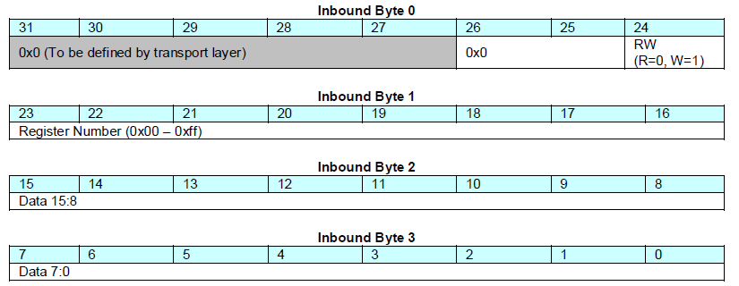

# ITLA 激光器常用指令封装库使用指南

## 概要

+ 本文是 ITLA 激光器常用指令封装库(ITLA.dll)的使用指南。
+ 本文将向您介绍所需的相关知识，以及封装库(.dll)的引入，API 的调用方式，减少您在使用或开发时的学习成本。在理解以后，您也可以自己重写或扩充封装。
+ 本文假设您已有一定的计算机知识与开发经验，以及看懂基本 C/C++ 代码或伪代码的能力。
+ **本封装库的作用：向您提供控制/设置 ITLA 激光器所需要写入的32位指令。由于机器与开发语言的差异，并不直接提供串口通信的功能。**

请在了解以上内容的情况下继续阅读。


## 基础

### 发送第一个指令

ITLA 激光器拥有诸多指令用于控制其工作。要使激光器完成某一项功能或设置，就需要向其发送相应的指令，因此，需要了解指令的格式，以及如何发送。

1 个基本的 ITLA 控制指令可以称为 **1 帧 (frame)**，由 32 bit 即 **4 字节**组成，其中**每个字节应该单独发送**。比如，若有 1 帧以 16 进制表示为 [0x81320008]  ，则应该以 [0x81, 0x32, 0x00, 0x08] 的形式，分别发送给激光器对应的串口。

这里给出一个示例：

```c
// 激光器在你机器上的串口号，假设为 7
int COM_PORT=7;
// 设置串口，包括设备名、波特率等
OpenComConfig (COM_PORT, deviceName, baudRate, parity, dataBits, stopBits, inputQueueSize, outputQueueSize);
// 刷新缓冲区
FlushInQ (COM_PORT);
FlushOutQ (COM_PORT);
// 具体的指令
unsigned short data[4]={0x81,0x32,0x00,0x08};	
for(int i=0;i<4;i++){
    // 发送给激光器
	ComWrtByte (COM_PORT, data[i]);
}
// 关闭串口	
CloseCom (COM_PORT);
```

如果您只用过原生的C/C++，对于上面的一些代码也许会有疑问。其实这是为了方便说明，所以我们使用了 NI 公司的 LabWindows 开发工具，它在 C/C++ 的基础上，提供了这些 RS232 串口通信库函数，让我们不必重复造轮子。相信您的团队也有类似的可复用代码。**重点是，我们希望您能理解 ITLA 指令应该以怎样的形式发送。**


### 原始数据与校验和

刚才我们已经向串口发送了一个指令： [0x81, 0x32, 0x00, 0x08] 。但事实上，这并非最原始的数据，而是经过**校验和算法 (Checksum) **处理过后的数据。事实上，其原始数据为 [0x01, 0x32, 0x00, 0x08]，每个字节都有其具体的含义。

+ **32 bit 中的 0 ~ 15 位，代表要发送的数据内容 (Data)，是可变动的数值，视具体功能而定，如示例中的 [0x00，0x08]。**
+ **32 bit 中的 16 ~ 23 位，代表每一类功能的编号 (Register Number)，如示例中的 [0x32]。**
+ **32 bit 中的 24 ~ 31 位，在原始数据中，只用第 24 位表示读写状态，其他位都为 0。[0x00] 表示该指令为读取，[0x01]表示为写入。我们只需要关心这两种情况，原始数据在经过 Checksum 处理以后，31 ~ 28 位将会发生变化。**



那么 **Checksum** 是怎样计算并使用的？这里给出代码示例：

```c
short calcBIP4(short* data) {
	short bip8 = (data[0] & 0x0f) ^ data[1] ^ data[2] ^ data[3];
	short bip4 = ((bip8 & 0xf0) >> 4) ^ (bip8 & 0x0f);
	return bip4;
}

void testChecksum() {
    short data[] = {0x01,0x32,0x00,0x08};
	short bip4 = calcBIP4(data);
	data[0] |= (bip4 << 4);
    for (int i = 0; i < 4; i++){
		printf("%x\n", data[i]);//0x81 0x32 0x00 0x08
	}
	return;
}
```

由此，您只要知道所需功能的原始指令，就可以直接得出最后用于发送的指令。或者根据发送的指令，得知这条指令的功能。

当然，还有很多细节我们没有谈到，如果您有兴趣深入了解，请参阅 OIF-ITLA-MSA 的官方手册。


## 使用 ITLA 封装库

### 为什么需要封装库

由之前的描述可知，如果我们要控制 ITLA 激光器，就需要自己随时查阅文档，构造许多不同的指令，**即使是同一个 Register Number， 其指令的 Data 部分也可能根据不同的参数进行变化，因此需要编写相应的转换算法**。这将带来很大的学习成本。因此我们已经为您做好了一些常用指令的封装，并且会根据需求进行扩充，您可以将更多的精力用于业务的实现。


### 文件引入

ITLA 激光器常用指令被封装为动态链接库，我们提供 ITLA.dll，ITLA.lib， ITLA. h 三个文件供您使用（如果您不了解动态链接库的相关内容，请自行查阅学习，或参考附录提供的简易教程）。

在 C/C++ 中，您可以通过多种方式来利用这些文件。

#### 使用 ITLA.dll + ITLA .lib + ITLA.h

将上述三个文件放入您的工程目录并引入，可以直接使用提供的所有函数。

```c
#include<stdio.h>
// 引入 ITLA .lib + ITLA.h
#pragma comment(lib,"ITLA.lib")
#include "ITLA.h"

// 测试功能
void test(){ 
   short data[4];
   // 获取设置激光器功率为 10dBm 所需要的指令
   LD_setPower(data, 10);
   for (int i = 0; i < 4; i++){
       printf("%x\n", data[i]); //0x61 0x31 0x03 0xE8
   }
   ...
}
```

#### 使用 ITLA.dll + ITLA.lib

将上述两个文件放入您的工程目录并引入，可以自主选择需要使用的函数。

```c
#include<stdio.h>
// 引入 ITLA .lib + ITLA.h
#pragma comment(lib,"ITLA.lib")
//  LD_setPower
extern "C" {
    _declspec(dllimport) void LD_setPower(short* data, short power);
    ...
}

// 测试功能
void test(){ 
   short data[4];
   // 获取设置激光器功率为 10dBm 所需要的指令
   LD_setPower(data, 10);
   for (int i = 0; i < 4; i++){
       printf("%x\n", data[i]); //0x61 0x31 0x03 0xE8
   }
   ...
}
```

#### 使用 ITLA.dll

将 ITLA.dll 放入您的工程目录，可以自主选择需要使用的函数。

```c
// windows API
#include<Windows.h>
#include<stdio.h>
int main(){
    // 加载库
    HINSTANCE hDLL = LoadLibrary(L"ITLA.dll");
    // 用于指向 LD_setPower
    typedef int(*LD)(short* data, short power);
    // 指向 LD_setPower 函数
    LD LD_setPower =(LD)GetProcAddress(hDLL,"LD_setPower");
    
    short data[4];
    // 获取设置激光器功率为 10dBm 所需要的指令
    LD_setPower(data, 10);
    for (int i = 0; i < 4; i++){
       printf("%x\n", data[i]); //0x61 0x31 0x03 0xE8
    }
    ...
}
```


## API文档

### 总览

| Name                | Register Number  | Read/Write | Description    |
| ------------------- | ---------------- | ---------- | -------------- |
| LD_setPower         | 0x31             | W          | 设置激光器功率 |
| LD_enableOut        | 0x32             | W          | 打开激光器     |
| LD_closeOut         | 0x32             | W          | 关闭激光器     |
| LD_setFreqOfChannel | 0x35, 0x36, 0x67 | W          | 设置激光器频率 |


### 详细

#### **LD_setPower**

void LD_setPower(short data[4], short power) 

| Parameter | Type     | Description                   |
| --------- | -------- | ----------------------------- |
| data      | short[4] | 接收指令的数组，期望维数：1*4 |
| power     | short    | 需要设置的功率，单位为 dBm    |


示例代码：

```c
/*
	输入您将要设置的激光器功率，以及接受指令的数组，LD_setPower 会将相应的指令传给该数组。
*/
int main() {	
	short data[4];
    // 输入功率为 10 dbm
	LD_setPower(data, 10);
	for (int i = 0; i < 4; i++){
		printf("%x\n", data[i]);//0x61 0x31 0x03 0xE8
	}	
}
```


#### LD_enableOut

void LD_enableOut(short data[4])

| Parameter | Type     | Description                   |
| --------- | -------- | ----------------------------- |
| data      | short[4] | 接收指令的数组，期望维数：1*4 |

示例代码：

```c
/*
	返回打开激光器的指令码，用于启用光输出
*/
int main() {	
	short data[4];
	LD_enableOut(data);
	for (int i = 0; i < 4; i++){
		printf("%x\n", data[i]);//0x81 0x32 0x00 0x08
	}	
}
```


#### LD_closeOut

void LD_closeOut(short data[4])

| Parameter | Type     | Description                   |
| --------- | -------- | ----------------------------- |
| data      | short[4] | 接收指令的数组，期望维数：1*4 |

示例代码：

```	c
/*
	返回关闭激光器的指令码，用于关闭光输出
*/
int main() {	
	short data[4];
	LD_closeOut(data);
	for (int i = 0; i < 4; i++){
		printf("%x\n", data[i]);//0x01 0x32 0x00 0x00
	}	
}
```


#### LD_setFreqOfChannel

void LD_setFreqOfChannel(short freData[3]\[4], double freq)

| Parameter | Type         | Description                   |
| --------- | ------------ | ----------------------------- |
| freData   | short[3]\[4] | 接收指令的数组，期望维数：3*4 |
| freq      | double       | 需要设置的频率，单位为 THz    |

示例代码：

```c
/*
	激光器频率需要分为三个 Channel 进行设置，因此返回3组指令
	这3组指令之间没有顺序要求
*/
int main() {	
	short fredata[3][4];
    // 设定频率为 194.175125 THz
	LD_setFreqOfChannel(fredata, 194.175125);
	for (int i = 0; i < 3; i++){
		for (int j = 0; j < 4; j++) {
            //0x91 0x35 0x00 0xC2
			//0x81 0x36 0x06 0xD7
			//0x81 0x67 0x00 0x19
			printf("%x ", fredata[i][j]);
		}
		printf("\n");
	}      
}

```


## 附录

## 动态链接库简易教程

### 基本概念

简单来讲，动态链接库可以被理解为，被编译过的，对外提供接口，在需要调用的时候才会被加载的独立程序。不会和开发的主程序一起打包为一个exe可执行文件。

在使用动态库时，往往提供两个文件：一个**导入库(**.lib，非必须) 和一个(.dll)文件。

### 准备工作

1. 开发工具 : Visual Studio  

2. 创建动态链接库工程，名为“DLLdemo”

3. 删除VS自动产生的初始文件

4. 项目——DLLdemo属性——C/C++——预编译头——取消预编译头

### 测试案例编写

```c++
MATH.cpp
    
#include "MATH.h"

int add(int a, int b) {
	return a + b;
}

int sub(int a, int b) {
	return a - b;
}
```

头文件

```c++
MATH.h
    
// 使得对外的接口名不会发生变化
extern "C" {
    //导出前缀
	 _declspec(dllexport) int add(int a, int b);
	 _declspec(dllexport) int sub(int a, int b);
	
}
```

编写完成后，生成解决方案，将会产生同名.dll 和 .lib 文件

### 使用动态链接库

#### 准备工作

创建一个空项目，名为 DLLtest

#### 静态调用

将DLLdemo.dll 和 DLLdemo.lib 文件移动到 DLLtext 工程目录下

##### 测试代码

```c++
// 导入前缀
#pragma comment(lib,"DLLdemo.lib")
#include <stdio.h>
extern "C" {
    //导入前缀
    _declspec(dllimport) int add(int a, int b);
    _declspec(dllimport) int sub(int a, int b);


}

int main() {
	int a = add(10, 10);
	int b = sub(10, 10);
	printf("%d\n", a);//20
	printf("%d\n", b);//0
}

```

#### 静态调用优化

手动导入函数实在太麻烦，所以我们对头文件进行改造，实现一个头文件可以同时担任导出与导入的工作。

```c++
Math.h
    
#pragma once

#ifdef DLL_EXPORT
#define DLL_EXPORT _declspec(dllexport)
#else
#define DLL_EXPORT _declspec(dllimport)
#endif // DLL_EXPORT

extern "C" {
	DLL_EXPORT int add(int a, int b);
	DLL_EXPORT int sub(int a, int b);
	
}
```

```c++
Math.cpp
    
#define DLL_EXPORT

#include "MATH.h"

int add(int a, int b) {
	return a + b;
}

int sub(int a, int b) {
	return a - b;
}
```

##### 测试代码

```c++
#pragma comment(lib,"DLLdemo.lib")

#include"MATH.h"

#include <stdio.h>

int main() {
	int a = add(10, 10);
	int b = sub(10, 10);
	printf("%d\n", a);
	printf("%d\n", b);
}
```


#### 动态调用

只需要将 DLLdemo.dll 移动到工程目录下

```c++
// windows API
#include<Windows.h>
#include<stdio.h>
int main(){
    // 加载库
    HINSTANCE hDLL = LoadLibrary(L"DLLdemo.dll");
    // 定义一个指针，用于后续指向动态链接库的函数
    typedef int(*p_add)(int a,int b);
    // 指向 add 函数
    p_add addFunction =(p_add)GetProcAddress(hDLL,"add");
    p_add subFunction =(p_add)GetProcAddress(hDLL,"sub");
    
    
    int a = addFunction(10,10);
	int b = subFunction(10, 10);
	printf("%d\n", a);//20
	printf("%d\n", b);//0
}
```


